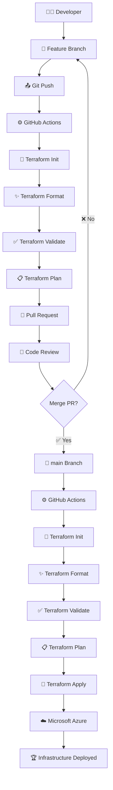
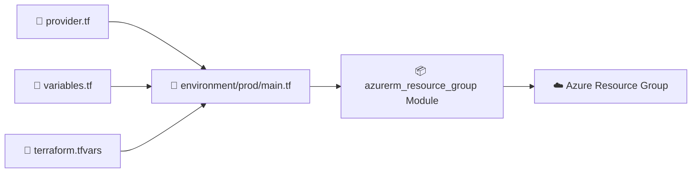
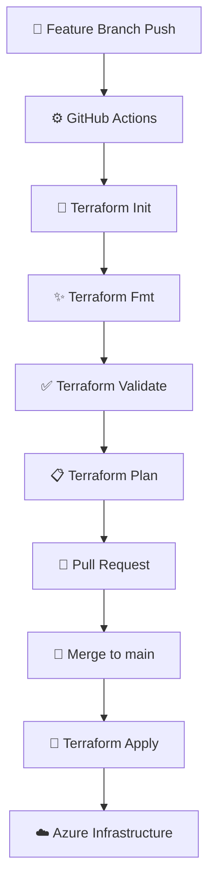
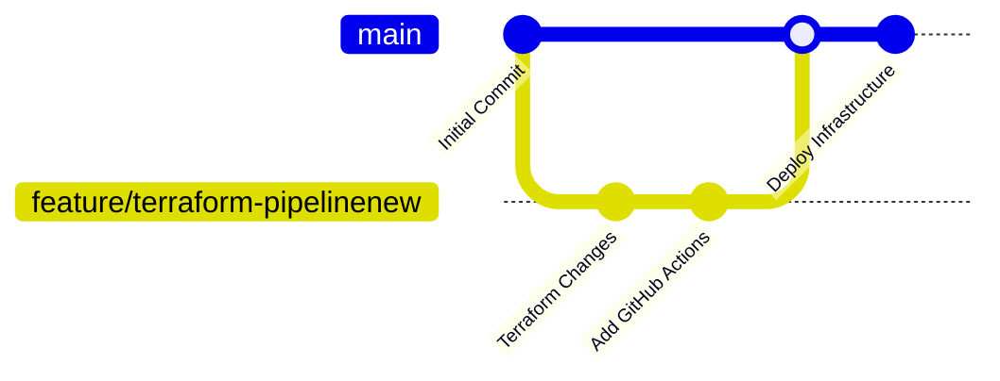

# 🚀 Terraform CI/CD Pipeline with GitHub Actions


> 🛠️ **Learning Project:** Terraform + GitHub Actions CI/CD pipeline for automating Azure infrastructure deployment.

---

## 📌 Project Overview

This project demonstrates how to build an automated **Terraform CI/CD pipeline using GitHub Actions**.

The main objective is to understand how Terraform code can be automatically validated, planned, and applied using a GitHub Actions workflow.

### 🎯 Pipeline Strategy

```text
👨‍💻 Developer
      │
      ▼
🌿 Feature Branch
      │
      ▼
📤 Git Push
      │
      ▼
⚙️ GitHub Actions
      │
      ├── 🔍 Terraform Format
      ├── ✅ Terraform Validate
      ├── 📋 Terraform Plan
      │
      ▼
🔀 Pull Request
      │
      ▼
👀 Review
      │
      ▼
✅ Merge into main
      │
      ▼
⚙️ GitHub Actions
      │
      ├── 🔍 Terraform Format
      ├── ✅ Terraform Validate
      ├── 📋 Terraform Plan
      └── 🚀 Terraform Apply
      │
      ▼
☁️ Azure Infrastructure
```

---

# 🏗️ Architecture / CI-CD Flow



---

# 🔄 CI/CD Workflow

## 🟡 Feature Branch

When development is done on a feature branch:

```bash
git checkout -b feature/terraform-pipelinenew
```

After making changes:

```bash
git add .
git commit -m "Add Terraform pipeline"
git push -u origin feature/terraform-pipelinenew
```

GitHub Actions automatically starts the pipeline.

### Feature Branch Pipeline

```text
🌿 Feature Branch
       │
       ▼
🔧 Terraform Init
       │
       ▼
✨ Terraform Format
       │
       ▼
✅ Terraform Validate
       │
       ▼
📋 Terraform Plan
       │
       ▼
🟢 Plan Successful
```

> 💡 **Important:** Feature branches perform `terraform plan` but do **not** perform `terraform apply`.

This prevents accidental infrastructure changes before the Pull Request is merged.

---

# 🔵 Pull Request

After the Terraform plan is successful:

1. Create a Pull Request.
2. Review the Terraform changes.
3. Check the GitHub Actions result.
4. Merge the Pull Request into `main`.

```text
🌿 Feature Branch
       │
       ▼
📋 Terraform Plan
       │
       ▼
🔀 Pull Request
       │
       ▼
👀 Review
       │
       ▼
✅ Merge
       │
       ▼
🌳 main
```

---

# 🟢 Main Branch

After the Pull Request is merged into `main`, GitHub Actions runs the deployment pipeline.

```text
🌳 main
  │
  ▼
⚙️ GitHub Actions
  │
  ├── 🔧 Terraform Init
  │
  ├── ✨ Terraform Format
  │
  ├── ✅ Terraform Validate
  │
  ├── 📋 Terraform Plan
  │
  └── 🚀 Terraform Apply
          │
          ▼
     ☁️ Azure
```

This is the **CD (Continuous Deployment)** part of the project.

---

# 📂 Project Structure

```text
CICD_Pipeline_GitHubAction/
│
├── 📁 .github/
│   └── 📁 workflows/
│       └── 📄 terraform.yml
│
├── 📁 environment/
│   └── 📁 prod/
│       ├── 📄 main.tf
│       ├── 📄 provider.tf
│       ├── 📄 variables.tf
│       └── 📄 terraform.tfvars
│
├── 📁 modules/
│   └── 📁 azurerm_resource_group/
│       ├── 📄 main.tf
│       └── 📄 variables.tf
│
├── 📄 .gitignore
└── 📄 README.md
```

---

# 🧩 Terraform Structure

The project follows a modular Terraform architecture.



### 📁 Environment

The `environment/prod` directory contains the production environment Terraform configuration.

### 📦 Module

The reusable Terraform module is located inside:

```text
modules/azurerm_resource_group/
```

This makes the infrastructure code reusable and easier to maintain.

---

# ⚙️ GitHub Actions Workflow

The workflow file is:

```text
.github/workflows/terraform.yml
```

The workflow is responsible for automating Terraform operations.

### 🔧 Main Terraform Operations

| Stage      | Command              | Purpose                        |
| ---------- | -------------------- | ------------------------------ |
| 🔧 Init    | `terraform init`     | Initialize Terraform           |
| ✨ Format   | `terraform fmt`      | Format Terraform code          |
| ✅ Validate | `terraform validate` | Validate configuration         |
| 📋 Plan    | `terraform plan`     | Preview infrastructure changes |
| 🚀 Apply   | `terraform apply`    | Apply infrastructure changes   |

---

# 📊 Pipeline Execution Graph



---

# 📈 CI/CD Pipeline Stages

```text
┌─────────────────────┐
│ 👨‍💻 Developer       │
└──────────┬──────────┘
           │
           ▼
┌─────────────────────┐
│ 🌿 Feature Branch   │
└──────────┬──────────┘
           │
           ▼
┌─────────────────────┐
│ ⚙️ GitHub Actions   │
└──────────┬──────────┘
           │
           ▼
┌─────────────────────┐
│ 🔧 Terraform Init   │
└──────────┬──────────┘
           │
           ▼
┌─────────────────────┐
│ ✨ Terraform Fmt    │
└──────────┬──────────┘
           │
           ▼
┌─────────────────────┐
│ ✅ Terraform        │
│    Validate         │
└──────────┬──────────┘
           │
           ▼
┌─────────────────────┐
│ 📋 Terraform Plan   │
└──────────┬──────────┘
           │
           ▼
┌─────────────────────┐
│ 🔀 Pull Request     │
└──────────┬──────────┘
           │
           ▼
┌─────────────────────┐
│ 👀 Code Review      │
└──────────┬──────────┘
           │
           ▼
┌─────────────────────┐
│ 🌳 Merge to main    │
└──────────┬──────────┘
           │
           ▼
┌─────────────────────┐
│ 🚀 Terraform Apply  │
└──────────┬──────────┘
           │
           ▼
┌─────────────────────┐
│ ☁️ Azure Resources  │
└─────────────────────┘
```

---

# 🔐 Security Concept

This project is created primarily for **learning and demonstration purposes**.

In a real production environment, sensitive information should **never** be hard-coded inside Terraform files or GitHub Actions workflows.

For production CI/CD, recommended approaches include:

* 🔐 GitHub Secrets
* 🔑 Azure Federated Identity Credentials
* 🪪 Managed Identity
* 🗝️ Azure Key Vault
* 🛡️ GitHub Environments
* 👥 Environment approvals

---

# 🧠 What I Learned

Through this project, I practiced:

### 🐙 Git & GitHub

* Creating repositories
* Creating branches
* Switching branches
* Git commit
* Git push
* Pull Requests
* Merging branches
* GitHub repository structure

### 🏗️ Terraform

* Terraform providers
* Terraform modules
* Variables
* `terraform.tfvars`
* `terraform init`
* `terraform fmt`
* `terraform validate`
* `terraform plan`
* `terraform apply`

### ⚙️ GitHub Actions

* Workflow creation
* YAML configuration
* Branch-based triggers
* CI pipeline
* CD pipeline
* Automated Terraform execution
* Feature branch validation
* Main branch deployment

---

# 🚦 Branch Strategy



### 🌿 Branch Responsibilities

| Branch          | Purpose               | Terraform Apply |
| --------------- | --------------------- | --------------- |
| 🌿 `feature/*`  | Development & Testing | ❌ No            |
| 🔀 Pull Request | Review                | ❌ No            |
| 🌳 `main`       | Production/Deployment | ✅ Yes           |

---

# 🛠️ Local Terraform Commands

To test Terraform locally:

```bash
cd environment/prod
```

Initialize Terraform:

```bash
terraform init
```

Format Terraform:

```bash
terraform fmt -recursive
```

Validate configuration:

```bash
terraform validate
```

Create execution plan:

```bash
terraform plan
```

Apply changes:

```bash
terraform apply
```

---

# 🐙 Git Commands

Clone repository:

```bash
git clone <repository-url>
```

Check current branch:

```bash
git branch
```

Create feature branch:

```bash
git checkout -b feature/terraform-pipelinenew
```

Add files:

```bash
git add .
```

Commit changes:

```bash
git commit -m "Update Terraform pipeline"
```

Push feature branch:

```bash
git push -u origin feature/terraform-pipelinenew
```

Switch to main:

```bash
git checkout main
```

Pull latest changes:

```bash
git pull origin main
```

---

# 📊 Project Workflow Summary

```text
             🚀 TERRAFORM CI/CD
                    │
        ┌───────────┴───────────┐
        │                       │
        ▼                       ▼
  🌿 FEATURE                 🌳 MAIN
        │                       │
        ▼                       ▼
   Terraform Init          Terraform Init
        │                       │
        ▼                       ▼
   Terraform Fmt           Terraform Fmt
        │                       │
        ▼                       ▼
 Terraform Validate      Terraform Validate
        │                       │
        ▼                       ▼
 Terraform Plan           Terraform Plan
        │                       │
        ▼                       ▼
       🔀 PR                🚀 APPLY
        │                       │
        ▼                       ▼
    👀 Review              ☁️ Azure
        │
        ▼
   ✅ Merge
        │
        └──────────────► 🌳 MAIN
```

---

# 🎯 Final Goal

The overall goal of this project is to understand how **Infrastructure as Code (IaC)** and **CI/CD automation** work together.

```text
👨‍💻 Code
   ↓
🐙 GitHub
   ↓
⚙️ GitHub Actions
   ↓
🏗️ Terraform
   ↓
📋 Plan
   ↓
🔀 Pull Request
   ↓
✅ Merge
   ↓
🚀 Apply
   ↓
☁️ Azure
```

---

# ⭐ Key Takeaway

> **"Build infrastructure like code, test it automatically, review it through Pull Requests, and deploy it safely through CI/CD."** 🚀☁️

---

## 🙌 Author

### 👨‍💻 Sujeet Kumar

**Cloud | DevOps | Terraform | Azure | GitHub Actions**

⭐ If you find this project useful for learning, feel free to explore, fork, and experiment with it!

---

# 📌 Project Status

🟢 **Learning Project — CI/CD Pipeline Implemented**

```text
Terraform        ████████████████████ 100%
GitHub Actions   ████████████████████ 100%
CI Pipeline      ████████████████████ 100%
CD Pipeline      ████████████████████ 100%
Azure            ████████████████████ 100%
```

🚀 **Keep Learning • Keep Automating • Keep Building!**
